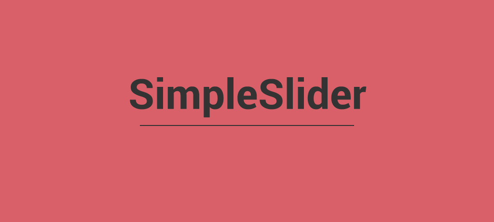

# jQuery Slideshow

Simple jQuery slideshow library. Lightweight, responsive, easy to implement & configure.

<a href="http://standardjs.com"></a> [](https://badge.fury.io/js/jquery-slideshow)

## Demo

[http://www.sjoloughlin.com/jquery-slideshow](http://www.sjoloughlin.com/jquery-slideshow)

## Installation

#### Download

Get the latest release from the [releases](https://github.com/sjoloughlin/jquery-slideshow/releases) page and add the files to your project.

Link the stylesheet inside your ```<head>``` tag:
```html
<link rel="stylesheet" type="text/css" href="slider.min.css" />
```
Then, before your closing ```<body>``` tag add:

```html
<script type="text/javascript" src="slider.min.js"></script>
```

#### NPM

```sh
npm install jquery-slideshow
```

## Usage

Add the following HTML for the slider:

```html
<ul class="slider">
  <li>
    
  </li>
  <li>
    
  </li>
  <li>
    
  </li>
</ul>
```

Then, before your closing ```<body>``` call ```.slider()``` on the slider element:

```html
<script type="text/javascript">
  $(window).on("load", function() {
    $(".slider").slider();
  });
</script>
```

## Configuration

The slider is configurable by passing in a configuration object when calling ```.slider()``` on the slider element:
```html
<script type="text/javascript">
  $(window).on("load", function() {
    $(".slider").slider({
      width  : '1024px', // Width of the slider
      height : '500px',  // Height of the slider
      speed  : 2000,     // How long the slide animation transition lasts for in millisecond
      delay  : 5000      // How long the slide will be displayed for in milliseconds
    });
  });
</script>
```

#### Options

| Config | Type | Default |  Description |
|--------|------|---------|--------------|
|`speed`|`int`|`1000`|How long the slide animation transition lasts for in milliseconds *e.g. 1000 = 1 second*|
|`delay`|`int`|`3000`|How long the slide will be displayed for in milliseconds *e.g. 3000 = 3 seconds*|
|`autoplay`|`boolean`|`true`|Whether to start the slideshow automatically|
|`navigation`|`boolean`|`true`|Whether to display left/right navigation buttons|
|`pagination`|`boolean`|`true`|Whether to display clickable slide indicators|
|`width`|`string`|`100%`|Width of the slider|
|`height`|`string`|`auto`|Height of the slider|
|`direction`|`string`|`right`|The direction that the slider will slide|
|`responsive`|`boolean`|`true`|Whether to make the size of the slider responsive|

## License

This project is licensed under the MIT License - see the [LICENSE.md](LICENSE.md) file for details.